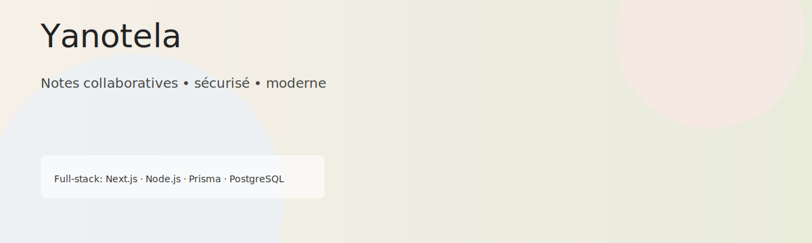

# Yanotela — Application de prise de notes collaborative

[](https://github.com/FlorianMMI/Yanotela/actions/workflows/main-before-merge.yml)
[](https://github.com/FlorianMMI/Yanotela/actions/workflows/develop-ec2.yml)
[](#tests)



Un projet full‑stack léger et moderne pour prendre des notes, collaborer en temps réel et gérer des contenus riches.

---

## ⚡ Aperçu

- Stackk frontend : Next.js 15 (App Router), TypeScript, TailwindCSS v4, éditeur Lexical
- Backend : Node.js + Express (ESM), Prisma ORM, PostgreSQL
- Auth : session-based (express-session). Tous les appels protégés utilisent `credentials: 'include'`.
- Collaboration : socket.io + yjs (fonctionnalités partielles / expérimentales)

---

## 📚 Sommaire

1. [Démarrage rapide](#-démarrage-rapide)
2. [Architecture & structure](#-architecture--structure)
3. [Commandes utiles](#-commandes-utiles)
4. [Conventions & bonnes pratiques](#-conventions--bonnes-pratiques)
5. [Tests](#-tests)
6. [Contribuer](#-contribuer)
7. [Licence & contact](#-licence--contact)

---

## �� Démarrage rapide

### Requis

- Docker (recommandé) ou Node.js 18+ & npm
- PostgreSQL (si vous ne passez pas par Docker)

### Avec Docker (recommandé)

Lancez la stack complète (client + serveur + postgres) :

```bash
docker compose up --build
```

- Client : http://localhost:3000
- API serveur : http://localhost:3001 (ou selon `NEXT_PUBLIC_API_URL`)

### Sans Docker (dev local)

1. Installer les dépendances :

```bash
# depuis la racine du repo
cd Client && npm install
cd ../Server && npm install
```

2. Lancer le serveur et le client dans deux terminaux :

```bash
cd Server && npm run dev
cd Client && npm run dev
```

3. Si vous modifiez le schéma Prisma :

```bash
cd Server && npx prisma generate
cd Server && npx prisma migrate dev
```

---

## 🏗️ Architecture & structure

Arborescence principale (extraits) :

```
Client/   # Frontend Next.js (pages dans Client/src/app/)
Server/   # Backend Express + Prisma
yjs-server/ # (optionnel) serveur de collaboration
```

- Composants client : `Client/src/components/`
- Loaders / helpers réseau : `Client/src/loader/loader.tsx`
- Contrôleurs serveur : `Server/src/controllers/`
- Routes serveur : `Server/src/routes/`
- Schéma Prisma : `Server/prisma/schema.prisma`

Contract court (entrée/sortie) :
- Entrées : requêtes HTTP JSON (cookies de session)
- Sorties : JSON (format d'erreur standardisé) ou redirections côté auth

---

## 🛠️ Commandes utiles

```bash
# Développer le client
cd Client && npm run dev

# Développer le serveur
cd Server && npm run dev

# Générer le client Prisma (après changement de schéma)
cd Server && npx prisma generate

# Appliquer une migration
cd Server && npx prisma migrate dev

# Lancer les tests serveur
cd Server && npm run test

# Lancer la stack Docker
docker compose up --build
```

---

## ✅ Conventions & bonnes pratiques

- Auth : session-based (pas de JWT), vérifiez `useAuthRedirect` côté client
- Tous les fetchs qui nécessitent auth doivent avoir `credentials: 'include'`
- Server `package.json` utilise `"type": "module"` — importez avec extensions `.js` si nécessaire
- Tests serveur : exécution avec `maxWorkers: 1` pour éviter les collisions sur la DB

Edge cases à garder en tête :
- Contenus Lexical stockés en string — convertir proprement côté loader
- Yjs/socket.io : fonctionnalités partielles — traiter la migration de contenu avec les scripts `Server/scripts/`

---

## 🔍 Tests

- Côté serveur : Jest (tests sous `Server/tests/`) — utilitaire de test partagé `Server/tests/testUtils.js`.
- Avant de lancer toute suite de tests qui touchent la DB, assurez-vous d'avoir configuré l'environnement de test (variables d'env, base test).

---

## 🤝 Contribuer

1. Fork & clone
2. Créez une branche `feature/XXX-description`
3. Respectez les conventions de commit (préfixe `[USX.Y] - `)
4. Ouvrez une PR vers `Develop`

Pour les changements de schéma Prisma :

```bash
cd Server && npx prisma generate
cd Server && npx prisma migrate dev
```

---

## 📄 Licence & Contact

**Licence**: MIT

**Contact & contributeurs**

Pour les questions, PRs ou rapports de bugs, ouvre une issue ou une Pull Request sur GitHub.

Contributeurs principaux (extraits depuis l'historique Git) :

- Florian Bounissou — florian.bounissou@etu.unilim.fr — Owner / Lead dev
- Julian Doutreligne — julian.doutreligne@gmail.com — Frontend
- Mael Valin — maelmy19@gmail.com — Backend
- Ethan Manchon — ethan.manchon@etu.unilim.fr — Contributor
- François Donzaud — donzaudf@gmail.com — Contributor

Remarque : pour un contact direct, préfère l'adresse indiquée ci‑dessus ou une issue GitHub afin de garder une trace des échanges.

Si tu veux que j'ajoute d'autres éléments (badges supplémentaires, logo vectoriel, ou badge de couverture lié à Codecov/Coveralls), dis‑le et je l'intègre.

