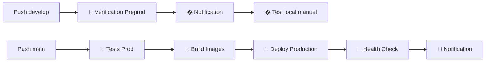

# 🚀 CI/CD Yanotela - Guide de déploiement

Pipeline automatisé pour déployer Yanotela sur AWS EC2 avec Docker.

## 📋 Flux de déploiement



## 🔧 Configuration requise

### 1. Secrets GitHub
📁 Voir le guide complet : [`deploy/SETUP-GITHUB-SECRETS.md`](./SETUP-GITHUB-SECRETS.md)

**Secrets obligatoires :**
- `EC2_HOST`, `EC2_USER`, `EC2_SSH_PRIVATE_KEY`
- `DOCKER_USERNAME`, `DOCKER_PASSWORD` (Docker Hub)
- `NOTIFICATION_EMAIL`, `NOTIFICATION_EMAIL_PASSWORD`
- `ENV_PROD_FILE`, `ENV_PREPROD_FILE`

### 2. Instance EC2
```bash
# Installer Docker sur EC2
sudo apt update && sudo apt install -y docker.io docker-compose
sudo usermod -aG docker ubuntu

# Créer les répertoires
mkdir -p ~/yanotela ~/yanotela-preprod
```

## 🎯 Utilisation

### Déploiement automatique
- **Push sur `develop`** → ✅ Vérification du code (tests + build)
- **Push sur `main`** → 🚀 Déploiement production automatique

### Test preprod (local)
```bash
# Après vérification réussie sur develop :
git checkout develop && git pull
docker-compose -f docker-compose.preprod.yml up --build
# Accès: http://localhost:8080
```

### Déploiement manuel production
```bash
# Via GitHub Actions
Repository → Actions → Select workflow → Run workflow

# Via scripts locaux (sur EC2)
./deploy/scripts/deploy.sh prod
```

## 🔍 Monitoring

### Health checks
```bash
# Vérifier le statut production
./deploy/scripts/health-check.sh prod

# Test local (preprod)
curl http://localhost:8080         # Frontend local
curl http://localhost:8081/health  # Backend local

# Production
curl http://VOTRE_IP              # Prod frontend  
curl http://VOTRE_IP:3001/health  # Prod backend
```

### Logs
```bash
# Logs services locaux (preprod)
docker-compose -f docker-compose.preprod.yml logs -f

# Logs production
docker-compose -f docker-compose.prod.yml logs -f

# Logs GitHub Actions
Repository → Actions → Cliquer sur le workflow
```

## 🔄 Rollback

### Automatique (production uniquement)
Le rollback s'effectue automatiquement en cas d'échec du health check en production.

### Manuel
```bash
# Production seulement
./deploy/scripts/rollback.sh prod

# Local (preprod) : pas de rollback nécessaire
docker-compose -f docker-compose.preprod.yml down
git checkout previous-commit
docker-compose -f docker-compose.preprod.yml up --build
```

## 📧 Notifications

Vous recevrez des emails automatiques pour :
- ✅ Déploiement réussi
- ❌ Déploiement échoué
- 🔄 Rollback effectué

## 🛠️ Scripts utiles

### Test preprod en local
```bash
# Démarrer l'environnement de test
docker-compose -f docker-compose.preprod.yml up --build -d

# Vérifier les services
curl http://localhost:8080        # Frontend
curl http://localhost:8081/health # Backend

# Développement classique (sans Docker)
cd Server && npm run dev         # Backend sur :3001
cd Client && npm run dev         # Frontend sur :3000
```

### Nettoyage
```bash
# Nettoyer les ressources Docker
docker system prune -af
docker volume prune -f

# Nettoyer les anciens backups
find . -name "backup_*" -type d -mtime +7 -exec rm -rf {} \;
```

## 🚨 Dépannage

### Problèmes courants

#### 🔑 Erreur SSH
```bash
# Vérifier la connectivité
ssh -i votre-cle.pem ubuntu@VOTRE_IP_EC2

# Vérifier les permissions de la clé
chmod 600 votre-cle.pem
```

#### 🐳 Erreur Docker
```bash
# Vérifier Docker sur EC2
docker --version
docker-compose --version
sudo usermod -aG docker ubuntu
```

#### 🏥 Health check échoué
```bash
# Local (preprod)
docker-compose -f docker-compose.preprod.yml ps
curl http://localhost:8080
curl http://localhost:8081/health

# Production 
sudo netstat -tlnp | grep :80
sudo netstat -tlnp | grep :3001

# Vérifier les Security Groups AWS
# - Port 22 (SSH)
# - Port 80 (Prod frontend)  
# - Port 3001 (Prod backend)
```

#### 📧 Emails non reçus
```bash
# Vérifier la configuration Gmail
# 1. Activer la validation en 2 étapes
# 2. Générer un mot de passe d'application
# 3. Utiliser ce mot de passe dans NOTIFICATION_EMAIL_PASSWORD
```

### Logs de débogage
```bash
# Voir tous les containers
docker ps -a

# Logs détaillés d'un service
docker logs CONTAINER_NAME

# Logs en temps réel
docker-compose -f docker-compose.prod.yml logs -f --tail=100
```

## 📁 Structure des fichiers

```
yanotela/
├── .github/workflows/
│   ├── production.yml      # Pipeline main → prod
│   └── preprod.yml         # Pipeline develop → preprod
├── deploy/
│   ├── scripts/
│   │   ├── deploy.sh       # Script de déploiement
│   │   ├── health-check.sh # Vérification santé
│   │   └── rollback.sh     # Script de rollback
│   ├── SETUP-GITHUB-SECRETS.md
│   └── README.md           # Ce fichier
├── docker-compose.yml      # Développement local
├── docker-compose.preprod.yml
├── docker-compose.prod.yml
├── .env.preprod
└── .env.prod
```

## 🎉 Prêt à déployer !

1. ✅ Configurez vos secrets GitHub
2. ✅ Préparez votre instance EC2  
3. ✅ Poussez sur `develop` pour tester
4. ✅ Poussez sur `main` pour la production

**🚀 Votre CI/CD est maintenant opérationnel !**